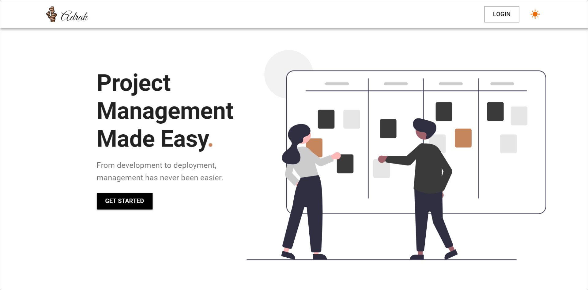
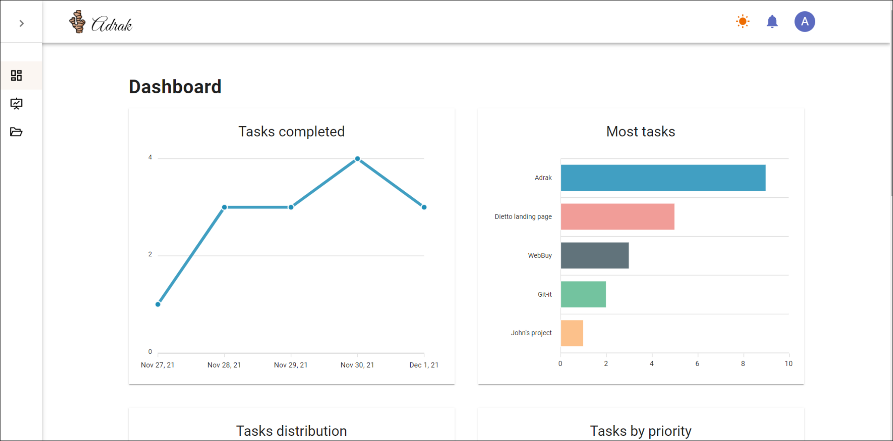
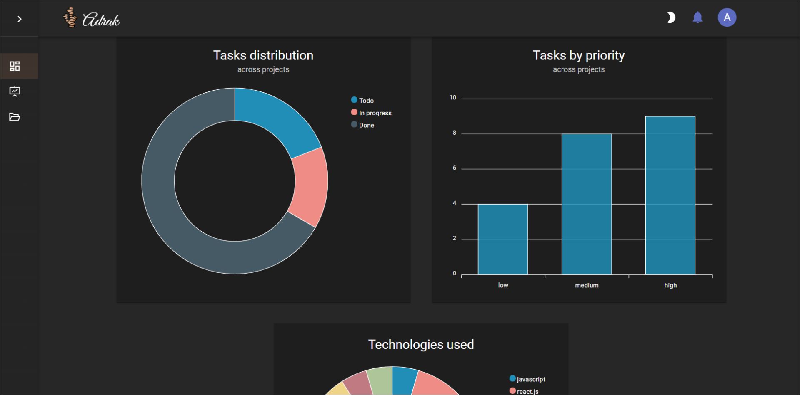
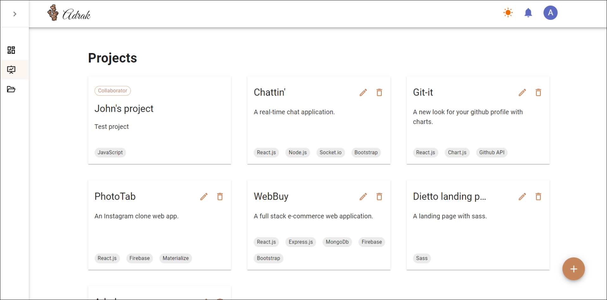
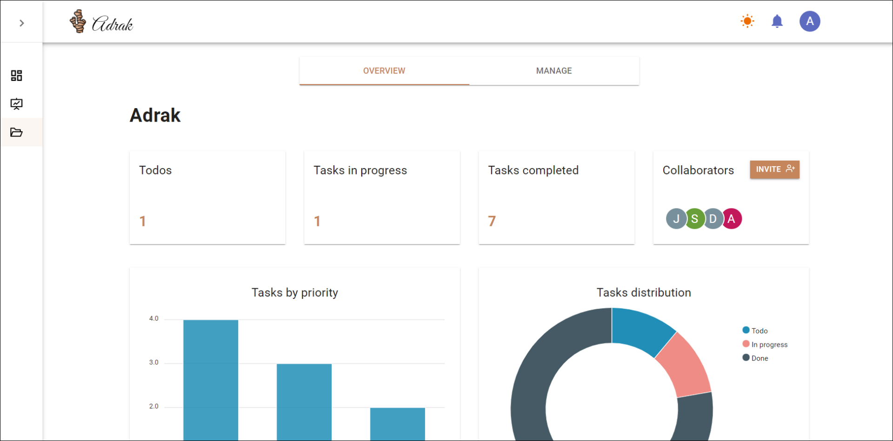
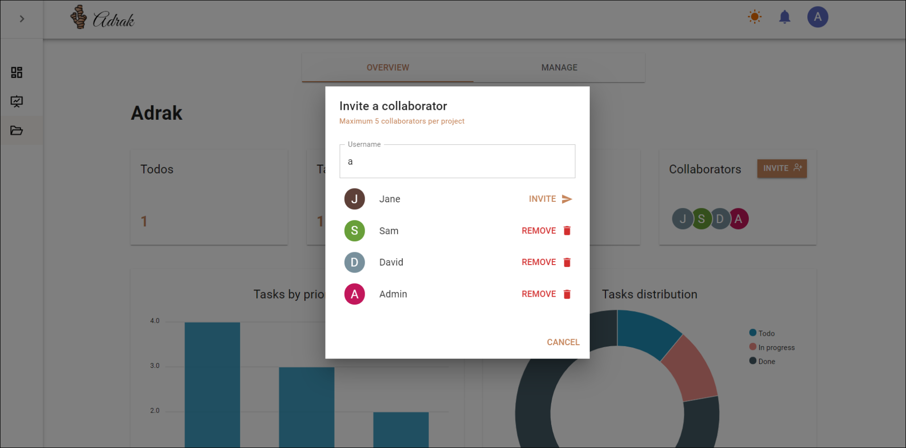
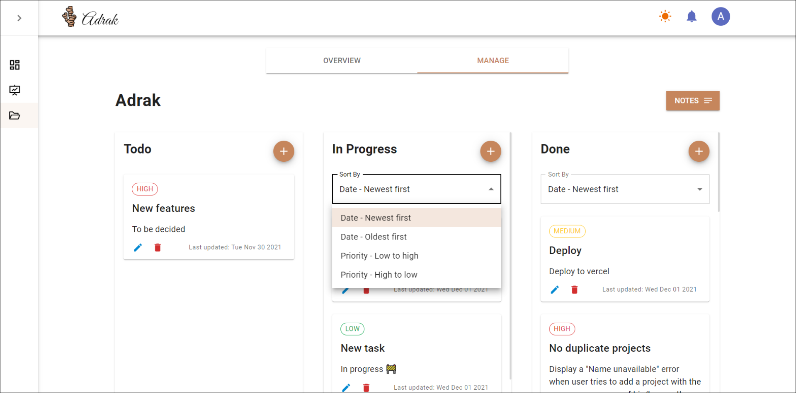
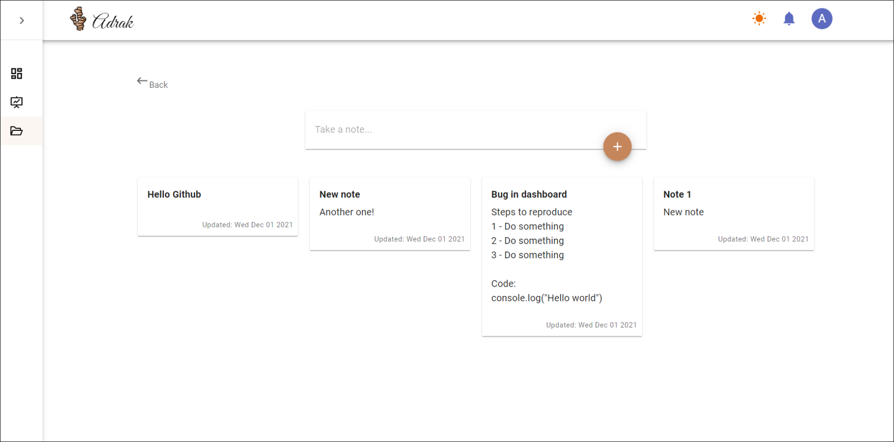
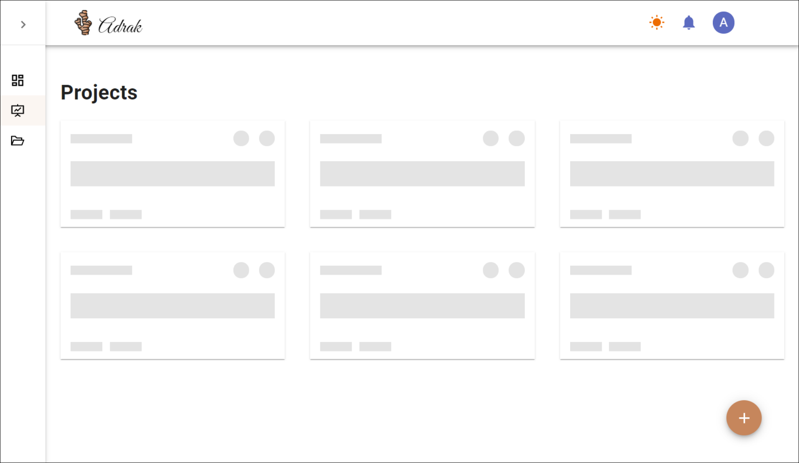
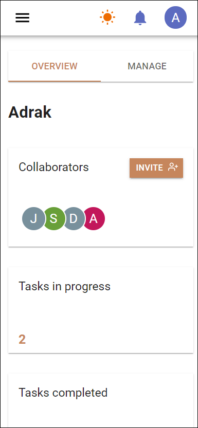

# Adrak

An web based project management system built using React.js, Redux, Express.js and MongoDB.
 
 

### Landing page

 
 

### Dashboard

 
 

### Dark mode

 
 

### Projects page

 
 

### Project overview

 
 

### Invite collaborators to work together on a project

 
 

### Manage project, CRUD tasks

 
 

### Separate notes section for each project

 
 

### Skeleton loading screens

 
 

### Mobile responsive

  

 
